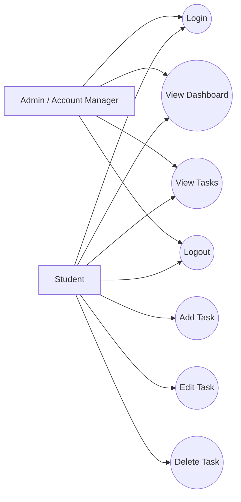

# Use Case Diagram

## Short Description

- **Student** logs in, views the dashboard, manages tasks, and logs out.
- **Admin / Account Manager** creates, edits, resets, and removes user accounts.
- For this project implementation, the application focus is the student task tracker plus account management.
