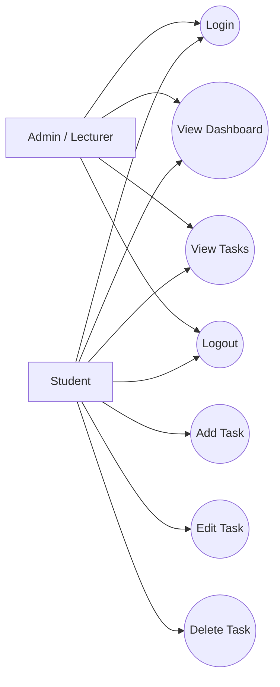

# Use Case Diagram

## Short Description

- **Student** logs in, views the dashboard, manages tasks, and logs out.
- **Admin / Lecturer** is shown only as a generic report actor if your lecturer wants a multi-user diagram.
- For this project implementation, the application focus is the student task tracker.
